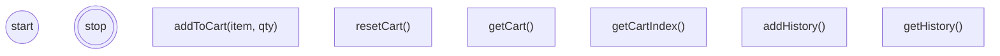

### Flowchart Function cart

```mermaid
flowchart TD

start((start))
stop(((stop)))
addToCart["addToCart(item, qty)"]
resetCart["resetCart()"]
getCart["getCart()"]
getCartIndex["getCartIndex()"]
addHistory["addHistory()"]
getHistory["getHistory()"]
```
