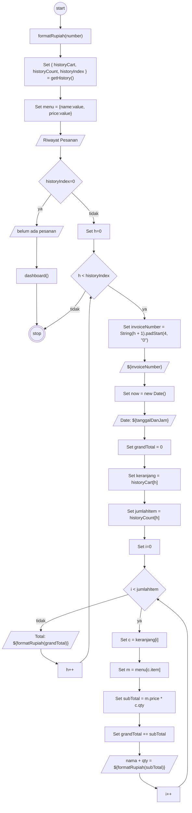

### Flowchart History

```mermaid
flowchart TD

start((start))
stop(((stop)))
formatRupiah["formatRupiah(number)"]
getHistory["Set { historyCart, historyCount, historyIndex } = getHistory()"]
menu["Set menu = {name:value, price:value}"]
out1[/"Riwayat Pesanan"/]
dcs1{historyIndex=0}
out2[/"belum ada pesanan"/]
dash["dashboard()"]
h["Set h=0"]
dcs2{"h < historyIndex"}
h+[h++]
invoiceNumber["Set invoiceNumber = String(h + 1).padStart(4, &quot;0&quot;)"]
inv[/"${invoiceNumber}"/]
now["Set now = new Date()"]
out3[/"Date: ${tanggalDanJam}"/]
grandTotal["Set grandTotal = 0"]
keranjang["Set keranjang = historyCart[h]"]
jumlahItem["Set jumlahItem = historyCount[h]"]
i[Set i=0]
dcs3{"i < jumlahItem"}
i+[i++]
c["Set c = keranjang[i]"]
m["Set m = menu[c.item]"]
subTotal["Set subTotal = m.price * c.qty"]
grandTotal+["Set grandTotal += subTotal"]
out4[/"nama + qty = ${formatRupiah(subTotal)}"/]
out5[/"Total: ${formatRupiah(grandTotal)}"/]

start-->formatRupiah-->getHistory-->menu
menu-->out1-->dcs1
dcs1--ya-->out2-->dash-->stop
dcs1--tidak-->h-->dcs2
dcs2--ya-->invoiceNumber-->inv-->now
now-->out3-->grandTotal-->keranjang-->jumlahItem
jumlahItem-->i-->dcs3
dcs3--ya-->c-->m-->subTotal-->grandTotal+-->out4-->i+-->dcs3
dcs3--tidak-->out5-->h+-->dcs2--tidak-->stop


```
