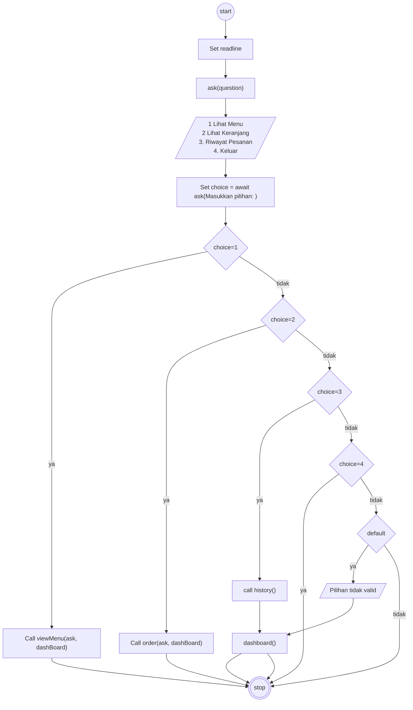

### Flowchart Index

```mermaid
flowchart TD

start((start))
stop(((stop)))
rl["Set readline"]
ask["ask(question)"]
out1[/"1 Lihat Menu
2 Lihat Keranjang
3. Riwayat Pesanan
4. Keluar"/]
choice["Set choice = await ask(Masukkan pilihan: )"]
dcs1{choice=1}
viewMenu["Call viewMenu(ask, dashBoard)"]
dcs2{choice=2}
order["Call order(ask, dashBoard)"]
dcs3{choice=3}
history["call history()"]
dcs4{choice=4}
dcs5{default}
out2[/"Pilihan tidak valid"/]
dash["dashboard()"]

start-->rl-->ask-->out1-->choice
choice-->dcs1--ya-->viewMenu-->stop
dcs1--tidak-->dcs2--ya-->order-->stop
dcs2--tidak-->dcs3--ya-->history-->dash-->stop
dcs3--tidak-->dcs4--ya-->stop
dcs4--tidak-->dcs5--ya-->out2-->dash-->stop
dcs5--tidak-->stop

```
