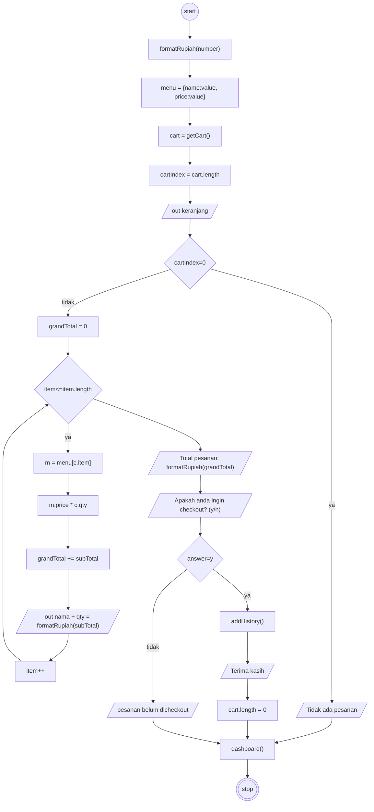

### Flowchart Function Order

```mermaid
flowchart TD

start((start))
stop(((stop)))
formatRupiah["formatRupiah(number)"]
menu["menu = {name:value, price:value}"]
cart["cart = getCart()"]
cartIndex["cartIndex = cart.length"]
out1[/"out keranjang"/]
dcs1{"cartIndex=0"}
out2[/"Tidak ada pesanan"/]
dash["dashboard()"]
grandTotal1[grandTotal = 0]
dcs3{"item<=item.length"}
m["m = menu[c.item]"]
subTotal["m.price * c.qty"]
grandTotal2["grandTotal += subTotal"]
out3[/"out nama + qty = formatRupiah(subTotal)"/]
item[item++]

out4[/"Total pesanan: formatRupiah(grandTotal)"/]
answer[/"Apakah anda ingin checkout? (y/n)"/]

dcs4{"answer=y"}
addHistory["addHistory()"]
out5[/"Terima kasih"/]
cartLength["cart.length = 0"]
out6[/pesanan belum dicheckout/]

start-->formatRupiah-->menu-->cart-->cartIndex
cartIndex-->out1-->dcs1
dcs1--ya-->out2-->dash
dcs1--tidak-->grandTotal1-->dcs3
dcs3--ya-->m-->subTotal-->grandTotal2-->out3-->item-->dcs3
dcs3-->out4-->answer-->dcs4
dcs4--ya-->addHistory-->out5-->cartLength-->dash
dcs4--tidak-->out6-->dash-->stop


```
