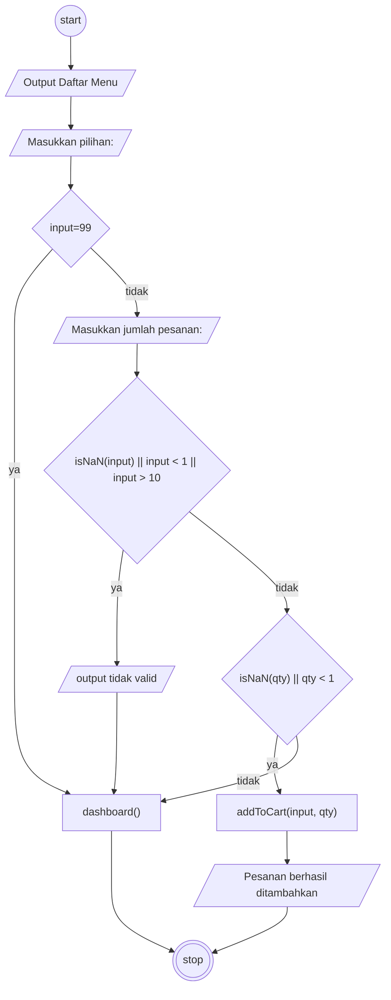

### Flowchart Function viewMenu

```mermaid
flowchart TD;

start((start))
stop(((stop)))
outputViewMenu[/ Output Daftar Menu/]
input[/ Masukkan pilihan: /]
dcs1{input=99}
dashboard["dashboard()"]
qty[/ Masukkan jumlah pesanan: /]
dcs2{"isNaN(input) || input < 1 || input > 10"}

dcs3{"isNaN(qty) || qty < 1"}
add["addToCart(input, qty)"]
result[/"Pesanan berhasil ditambahkan"/]

start-->outputViewMenu-->input
input-->dcs1
dcs1--ya-->dashboard
dcs1--tidak-->qty
qty-->dcs2
dcs2--ya-->out[/"output tidak valid"/]-->dashboard
dcs2--tidak-->dcs3
dcs3--ya-->add-->result-->stop
dcs3--tidak-->dashboard-->stop


```
